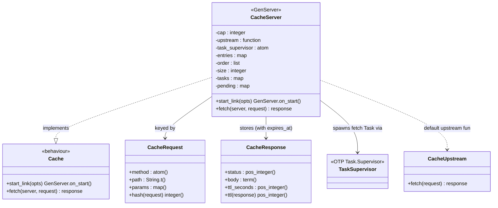
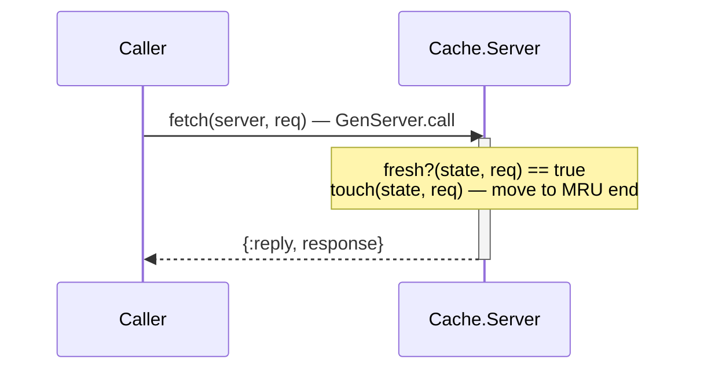
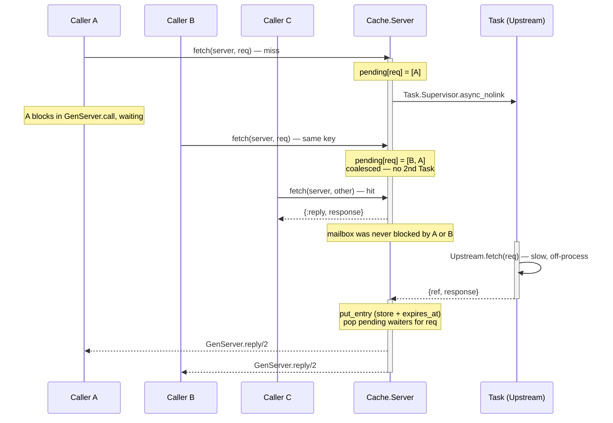

# Architecture

`Cache.Server` is a `GenServer`-backed cache that wraps a slow upstream `fetch(req) -> res`,
keyed by `Cache.Request` structs and valued by `Cache.Response` structs. Currently at **V3**
(capped capacity, true LRU eviction, TTL expiry) of the exercise's progressive V0–V4 scope.

## Class / module diagram

`Cache.Server` is the only stateful piece. It implements the minimal `Cache` behaviour
(`fetch/2`, `start_link/1`), uses `Cache.Request` structs directly as map keys (Elixir hashes
arbitrary terms internally in O(1) average; `Cache.Request.hash/1` is provided as the explicit
hashing function the exercise assumes exists), stores `Cache.Response` structs alongside a
computed `expires_at`, and hands slow work off to a `Task.Supervisor` rather than calling
upstream inline. `Cache.Upstream` is the default upstream — any 1-arity `request -> response`
function works, and tests supply their own fast, call-counting fake instead.

## Data flow

Cache hits are answered directly from in-memory state inside `handle_call/3` — fast,
synchronous, no process spawned. Cache misses run on a supervised `Task` so one slow upstream
call never blocks other callers, and concurrent callers asking for the *same* in-flight request
are coalesced onto the single upstream call already in progress instead of triggering a second
one.

### Cache hit

### Cache miss, with waiter coalescing

## High-level design

**Why the async-fetch/waiter pattern.** If the upstream call happened directly inside
`handle_call/3`, the GenServer's single mailbox-processing loop would freeze on it — every
other caller, even ones asking for something already cached, would queue up behind that one
slow call. That would violate the exercise's "must support high concurrency" requirement, which
is a base assumption, not a V4-only concern. So on a miss, `Cache.Server`:

1. Records the caller (`from`) as a waiter for that request in `pending`.
2. Spawns the upstream call in a supervised `Task` (`Task.Supervisor.async_nolink/2`) and
   returns `{:noreply, state}`, freeing the GenServer to keep handling other messages.
3. A second concurrent caller for the *same* in-flight request is added to that request's
   waiter list instead of starting a redundant upstream call (request coalescing).
4. When the `Task` finishes, it messages the GenServer (`handle_info/2`), which stores the
   result and replies to every waiter via `GenServer.reply/2`.

**Eviction — LRU.** `order` is a plain list, most-recently-used first. A cache hit "touches"
its entry (removes it from its current position, pushes it to the MRU end); a fresh insert
does the same. Once `size > cap`, the entry at the LRU end is evicted. This is `O(n)` in `cap`
— an intentional, documented tradeoff for V1–V3. The exercise's V4 (amortized O(1)
end-to-end) is exactly where this would be replaced by an ETS-backed doubly-linked list, with
`Cache.Server` still owning all writes serially for correctness but reads hitting ETS directly
instead of round-tripping through the GenServer mailbox.

**Expiry — TTL.** Each entry stores `expires_at`, computed as
`System.monotonic_time(:second) + Cache.Response.ttl(response)` at insert time (monotonic, so
immune to wall-clock adjustments). A hit on an expired entry is treated exactly like a miss:
the stale entry is evicted and the request re-enters the same async-fetch/coalescing path as a
first-time miss.

### State reference

| Field | Purpose |
|---|---|
| `cap` | Maximum number of distinct entries before LRU eviction kicks in. |
| `upstream` | 1-arity `request -> response` function — the thing being cached in front of. |
| `task_supervisor` | Where miss-handling Tasks are spawned, so a crashed upstream call can't take the cache down with it. |
| `entries` | `request => {response, expires_at}` — the actual cache, keyed by the request struct itself. |
| `order` | MRU-first list of keys, used for LRU eviction. `O(n)` touch/evict (see note above). |
| `size` | Current entry count, tracked alongside `entries` to avoid a `map_size/1` call per write. |
| `tasks` | `task_ref => request` — lets `handle_info/2` know which request a finished Task belongs to. |
| `pending` | `request => [from, ...]` — waiters for an in-flight miss; this is the coalescing mechanism. |
